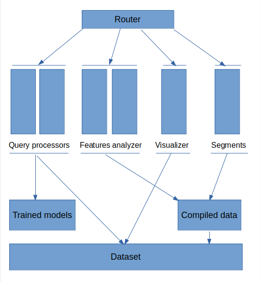

# Backend for car data analysis
(MS Engage 2022 Final submission).

## Introduction
This is the implementation of the backend for car data analysis frontend on https://github.com/ishaan-pare/car_data_analysis_frontend.git it content implementation of Rest API and use of data analysis and machine lerning models which are created on jupyter notebook. All the request from frontend are compiled and processed here only and the result will be fetch from here to deliver the result on frontend.

## System requirements

1)  Laptop or PC 
2)  Python version 3.8=<
3)  pip preinstalled

## Installation 

1)  Open terminal and command prompt to start installation
2)  Clone this repository by typing git clone url/to/this/repo
3)  After cloning this repo install requirenments by typing pip install -r requirements.txt
4)  once all the requirements successfully installed run app.py file to start the server

#### Note: If you want to see the results then you need to run frontend of this project 

## Working 

Top level is router which process all the request from the client and transfer it to different blocks, and these blocks further communicate with lower level assets like compiled data, datasets and trained model. These level commpute requested input and send back to the router to transfer result to the cliet.

<b> For example</b> Query processors which is responsible for two things first is query processing and second one is predicting the features is further uses trained models and dataset to respond to that request and tranformed result again send back to client as a response to the request.

Middle level components are.

1)  Query processors
2)  Features analysus
3)  Visualizer
4)  Customer Segments
*Arrows are indicating flow of requests.

## ML Model flow diagram

6 Machine learning model created for predictions of different features

1)  Sales predictor based on price - Decision Tree Regressor (91%)
2)  Sales predictor based on SoftFeatures - Decision Tree Regressor (81%)
3)  Price predictor based on SofFeatures - Ridge Regression (99%)
4)  Price predictor based on HardFeatures - Decision Tree Regressor (70%)
5)  HardFeatures Predictor based on SoftFeatures - Lasso Regression (70%)
6)  SoftFeatures Predictor based on Price - Lasso Regression (81%)

#### With the help of this machine learning model and graph structure a logic is generated to predict all possible features.
